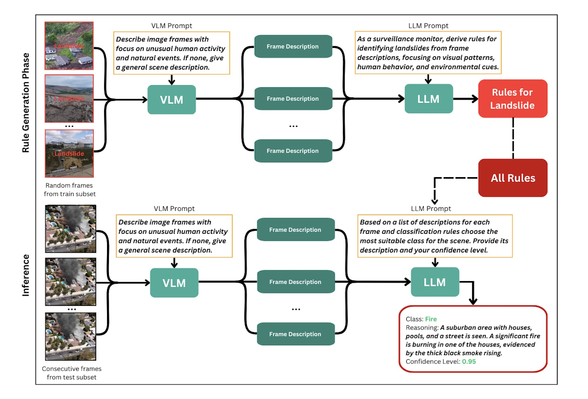

# Explainable Disaster Detection with LLM-Guided Video Analysis

## Overview



Disaster detection enhanced by artificial intelligence enables autonomous environmental monitoring and early warnings, reducing the impact of catastrophes and saving lives. While classic systems can differentiate between disaster types, they often lack **reasoning**, resulting in misinterpretations, false positives, and reduced trust in alerts.

We propose a **Large Language Model (LLM)-based framework** for rapid disaster detection from video sequences. It consists of two main phases:

- **Learning Phase**:  
  Generate textual descriptions for video frames and derive classification rules based on known labels.

- **Inference Phase**:  
  Use the generated rules to guide the LLM in predicting the disaster type for new video data, along with reasoning behind each prediction.

This framework delivers both **accurate** and **explainable** disaster classifications.

We also introduce a **novel video disaster dataset**, featuring **9 challenging disaster scenarios**, each accompanied by a textual description.

---
## Dependencies

```
conda env create -f environment.yml
conda activate VideoProject

```

## Dataset
Download the dataset, unzip it and put {train}, {test} and {val} in the {Dataset} folder.

```
Dataset/
├── train/
├── test/
├── val/

```

Download links: 
* [DisasterEye_V2.0](https://drive.google.com/file/d/1RlhlaDadr_4AcLW5xOAg0-r43n79btYL/view?usp=sharing)


## Run

### Step 1: Frame Extraction and Description
```
python dataset.py --data='Dataset'
python gwen_image2text.py --data='Dataset' --data_split=test
```
Ps: You should get frames in folders that corespond to video names and train.csv, test.csv, val.csv that you will use to generate frame descriptions. Output after generating video frame descriptions should be in Dataset folder with name test_with_descriptions.csv. 

### Step 2: Rule Generation
```
python main.py --data='Dataset' --induct --b=10 --bs=32
```
PS: You need to provide yourown OpenAI API key to perform this step. The output should be in rule folder.

### Step 3: Inference
```
python main.py --data='Dataset' --deduct --model=gemma
```
PS: You can also start from Step 3 because we provide rules and video frames descriptions.

### Step 4: Evaluation of accuracy and reasoning quality
```
python main.py --data='Dataset' --evaluate
python reasoning_test.py
```
PS: You can start from this step using our provided predictions and Gemini-labeled ground truth.
